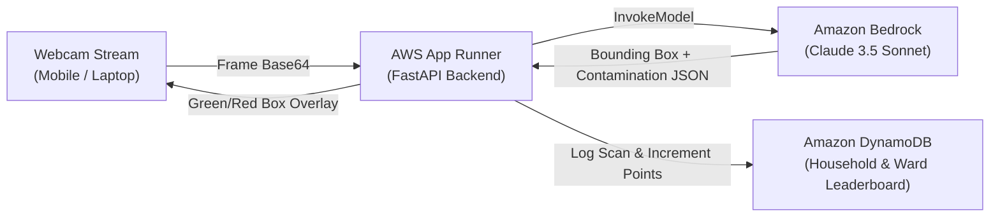

# Sankalp-Squad: SegregateGuard
### Source-Level Waste & Contamination Inspector
**Bharat Builds Tour: Environmental Hacks (Track 03 - Waste and Energy)**  
Powered by **Amazon Bedrock (Claude 3.5 Sonnet Vision)** & **Amazon DynamoDB**, deployed on **AWS App Runner + AWS Amplify**.

---

## 🌍 The Problem
Recycling systems fail at the source because mixed waste (e.g. food grease or unwashed plastics inside dry recyclable bins) cross-contaminates entire truckloads, forcing **over 70% of recyclable material directly into landfills**.

## 💡 The Solution
**SegregateGuard** requires **zero custom hardware**—running directly on any smartphone or laptop webcam.
Citizens or facility workers point their camera at their waste bin before disposal:
1. **Live Detection & Contamination Audit:** Amazon Bedrock (Claude 3.5 Sonnet Vision) inspects the item for oil, moisture, leftover liquids, and material type.
2. **Real-time Bounding Box Feedback:** 
   - 🟢 **Green Bounding Box:** Clean recyclable / compostable verified.
   - 🔴 **Red Bounding Box:** Cross-contamination detected (e.g. *"Greasy pizza box in dry bin — tear off clean lid, move greasy base to landfill"*).
3. **Gamified Ward/Household Scores:** Automatically increments user points and tracks contamination violations prevented in **Amazon DynamoDB**.

---

## 🏗️ Architecture



---

## 📁 Repository Structure

```text
sankalp squad/
├── backend/                  # FastAPI Backend Service
│   ├── app/
│   │   ├── main.py           # REST API endpoints & CORS
│   │   ├── bedrock_service.py# Amazon Bedrock Claude Vision client
│   │   ├── dynamodb_service.py# DynamoDB audit logging & user score tracker
│   │   ├── models.py         # Pydantic schemas (BoundingBox, UserScore, etc.)
│   │   ├── prompts.py        # Indian SWM 2016 contamination prompts
│   │   └── config.py         # App configuration
│   ├── Dockerfile            # Container for AWS App Runner
│   ├── requirements.txt      # Python dependencies
│   ├── test_api.py           # Self-verifying test suite
│   └── README.md
├── .gitignore
└── README.md
```

---

## 🚀 Running the Backend Locally

```powershell
cd backend
pip install -r requirements.txt
python -m uvicorn app.main:app --reload --port 8000
```
Interactive API Docs available at: `http://localhost:8000/docs`
